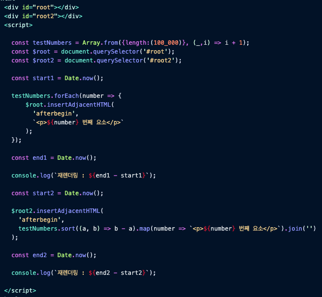

# 타입스크립트 시작하기

* REPL: read evaluation print loop&#x20;
  * cli 혹은 콘솔환경이라고 함 (리플)

* Type vs Interface
  * 확장하는 의미로
    * & 와 extends 로 사용할 수 있음
  * 인텔리센스
    *   type

        .png>)

        * interface

        .png>)
  *   merge 기능

      * type 지원하지 않음
        * interface\
          \
          이게 유용한 기능인가?? 이걸 봤을 때 바로 든 느낌이 var 를 사용하는 방식과 비슷한 느낌이 드는데.. 협업에서는 위험해보임.\
          \- 다른 사람이 내가 의도하지 않은 타입을 막 병합해놔서 타입제한이 제대로 되지 않을 위험이 있어보임! \

> &#x20;

*
* ts-node 는 타입스크립트를 어떻게 실행시키는거지..?? 자스는 인터프리터언어로 바로바로 해석이 되어버리는데 그럼 타스는 언제 해석되는거야?? 걔도 한줄한줄해석되는거야...??
* 아니 그럼 & 이게 나름에 확장인데.. extends 랑 차이는뭐지..\
  사실 차이라고하기 보단 다른 의미라고 보는게 좋을 것 같음.&#x20;
